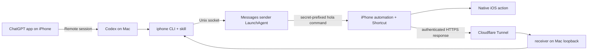

# Codex iOS Assistant

Codex iOS Assistant lets Codex on a Mac control an iPhone. The `iphone` CLI sends private commands through iMessage. An iOS Shortcut runs the requested action and returns context from your iPhone back to your Mac.

> [!TIP]
> This project is meant to be installed with Codex! To install it, please paste this message into a new Codex thread on your Mac:
>
> ```text
> Please set up the `Samin100/codex-ios-assistant` GitHub project. I want to get it working on my own Mac and iPhone. Notify me when my input is required. Otherwise, please set up this project entirely on your own.
> ```

## Supported commands

- Read visible text or save a screenshot from the iPhone.
- Read and replace the clipboard.
- List enabled alarms, create an alarm, or disable alarms at a given time.
- Open Camera, Weather, Calendar, Calculator, Messages, Find My, Spotify, Photos, Wallet, Notes, Books, App Store, Uber, and DoorDash.
- Open the Home Screen or Control Center; control timers, the flashlight, and Low Power Mode; place calls.
- Search Mac Contacts and read the Mac's Messages database.

Message composition opens a draft for review. The CLI does not send ordinary messages, buy anything, install apps, order food, or request rides.

## How it works



The Messages sender runs as a per-user LaunchAgent. This keeps Messages automation outside the Codex sandbox, where LaunchServices may be unable to resolve `com.apple.MobileSMS`.

See [Architecture and protocol](docs/architecture.md) for request formats and trust boundaries.

## Requirements

- A Mac running macOS 14 or newer, with Python 3.11+, Messages, and Xcode Command Line Tools.
- An iPhone that receives messages sent to the configured iMessage address.
- A domain managed in Cloudflare.
- iCloud sync for Shortcuts.

The ChatGPT desktop and mobile apps are required only for the Remote workflow.

Phone actions use a versioned, correlated receipt protocol. The CLI registers
each request over a private Unix socket before sending the iMessage, and Nami
reports success only after the matching one-time phone receipt arrives. A
Messages delivery acknowledgment alone is never treated as execution.

## Install

```bash
git clone https://github.com/samin100/codex-ios-assistant.git
cd codex-ios-assistant
brew install cloudflared steipete/tap/imsg
./scripts/install
./scripts/setup-cloudflare
./scripts/install-services
./scripts/copy-shortcut
```

Configuration has four values: the iMessage address that reaches your iPhone, a stable HTTPS hostname such as `https://iphone.example.com`, a generated receiver token, and a generated private command secret. The installer stores them in `~/.config/codex-ios-assistant/`, outside the repository. The secret is prepended to every wire command and required by every Shortcut branch before a phone action can run.

`scripts/copy-shortcut` puts 244 native Shortcuts actions on the Mac clipboard. Paste them once into a blank shortcut and name it `iOS Assistant`. After iCloud syncs it to your iPhone, create the automation that listens for commands:

1. Open Shortcuts > Automation, tap the plus sign at the bottom, then choose New Automation > Message.
2. Under `When I receive a message where`, use your own iMessage contact when self-message matching works; otherwise `Any Sender` is supported by the current secret-gated Shortcut.
3. Tap `Add Filter` and set `Message contains` to `hola`.
4. Tap `Run Shortcut` and select `iOS Assistant`.

You must create this automation by hand in the Shortcuts app on your iPhone. Follow the [installation guide](docs/installation.md) for the remaining Apple permissions.

## Test the setup

```bash
iphone doctor
curl http://127.0.0.1:8787/health
iphone home
iphone screen read --timeout 30
iphone alarm list --timeout 30
```

`iphone home` returns `completed` only after the matching phone-side receipt
arrives. Commands that wait for data from the phone, including `screen read`
and `alarm list`, return `completed` after their capability-bound response
reaches the Mac.

## Files

| Path | Contents |
| --- | --- |
| `src/iphone_cli/` | CLI, Messages bridge, receiver, and URL builders |
| `shortcut/actions.template.plist` | Sanitized 244-action Shortcut template |
| `scripts/` | Install, configuration, tunnel, LaunchAgent, and clipboard tools |
| `skills/iphone-control/` | Codex skill installed under `~/.agents/skills` |
| `contacts/` | Swift Contacts search helper |
| `tests/` | Python tests and Shortcut validation |

## Docs

- [Installation](docs/installation.md)
- [Commands](docs/commands.md)
- [Architecture and protocol](docs/architecture.md)
- [Shortcut maintenance](docs/shortcut.md)
- [Cloudflare Tunnel](docs/cloudflare.md)
- [Security](docs/security.md)
- [Troubleshooting](docs/troubleshooting.md)
- [Development](docs/development.md)

Released under the [MIT License](LICENSE).
